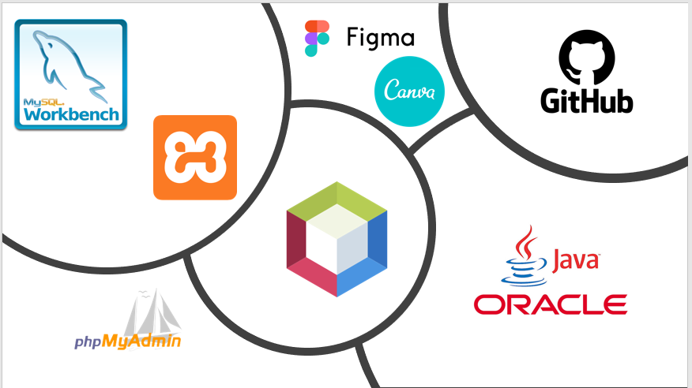
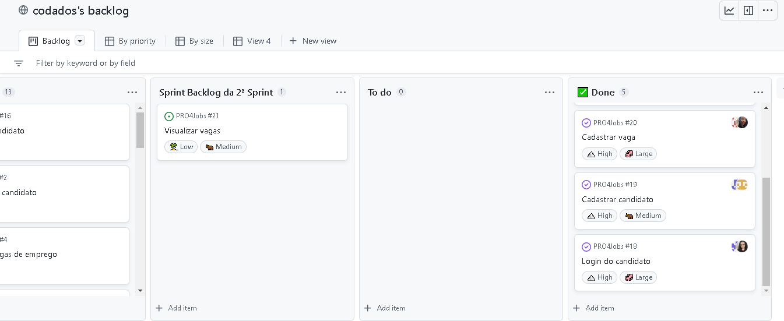
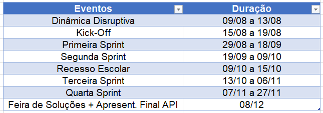
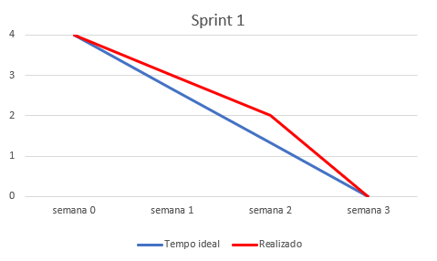
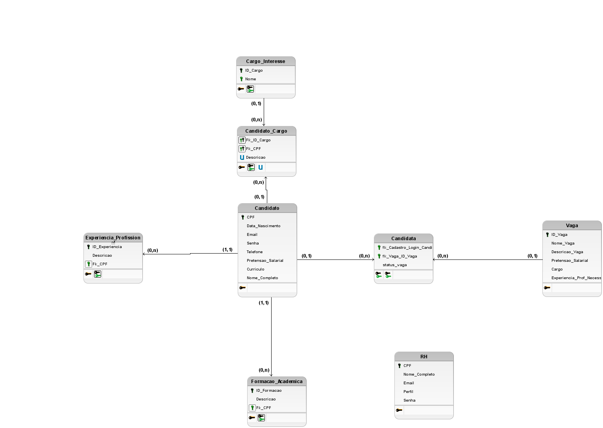
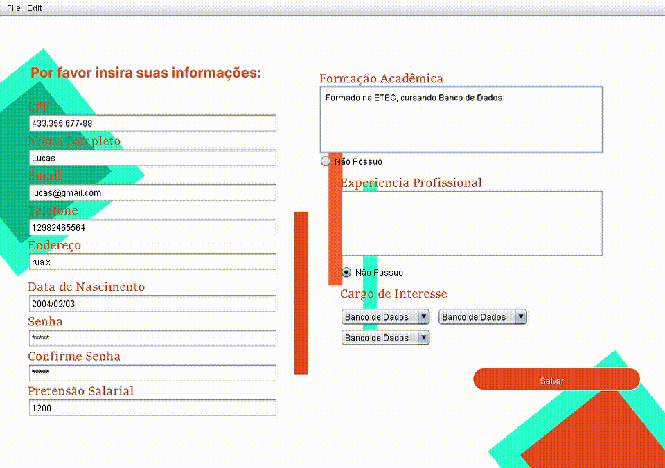
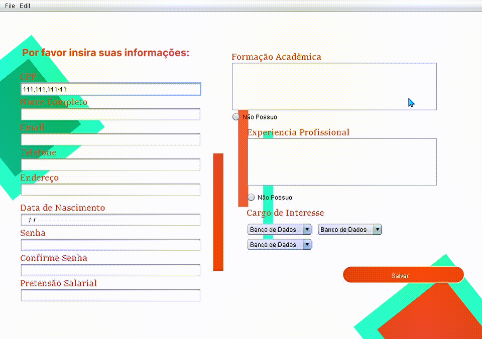

<h1 align="center"> Grupo Codados</h1>

 

## Sobre o Projeto PRO4Jobs :desktop_computer:

* PRO4Jobs é uma aplicação Desktop com o objetivo de gerenciar vagas de emprego, otimizar o trabalho das pessoas do setor de Recursos Humanos;
* O Candidato poderá vizualizar e se candidatar as vagas de emprego que o RH disponibilizará;
* Este Projeto tem como Cliente a empresa PRO4TECH;
* A aplicação tem como linguagem de programação o Java, pois foi a linguagem designada para o Segundo Semestre de Banco de Dados;
* Para registrar vagas, candidatos e o pessoal do RH, é necessário a criação de um Banco de Dados, o qual será conectado com a linguagem Java;
* Utilizando a Metodologia Scrum, a equipe pode desenvolver este Projeto com agilidade, qualidade e boa organização.
 

## Informações sobre o Cliente :technologist:

| Cliente | Contato |
| --- | --- |
| `Rafael Monteiro` | rafael.monteiro@pro4tech.com.br |

 

## Integrantes do grupo :woman_technologist: :man_technologist: :  
| Integrante | Função |
| --- | --- |
| `Cainan Thomas Branco Santos` | Desenvolvedor |
| `Daniele de Jesus Souza` | Desenvolvedora |
| `Felipe dos Santos Bispo` | Desenvolvedor |
| `Guilherme Augusto Wunderlich Serapião` | Desenvolvedor |
| `Júlia Pereira Quitério` | Desenvolvedora |
| `Lucas Emanoel Teixeira Engracio da Silva` | Product Owner |
| `Marcella Yanes Borges do Amaral` | Scrum Master |
 

## :page_facing_up: Backlog do Produto:
 

 Prioridade | Requisito |
| --- | --- |
|1| Cadastrar RH |
|1| Login RH |
|1| Cadastrar Candidato |
|1| Login Candidato|
|1| Cadastrar Vaga de Emprego |
|2| Visualizar Vagas de Emprego |
|2| Anexar Currículo |
|2| Criar Relatório das Vagas|
|2| Cadastrar Candidato a Vaga de Emprego |
|2| Avaliar Candidato |
|2| Realizar Relatório dos Candidatos Aprovados|
|2| Emitir Relatório dos Candidatos |
|2| Excluir Vaga de Emprego |
|3| Alterar Vaga de Emprego |
|3| Implementar Progresso do Candidato |
|3| Filtrar Vagas por Área de Atuação |
|3| Gerar relatório para o RH |

### Legenda: 1- Imprescendível; 2- Importante; 3- Desejável
  

## Tecnologias Utilizadas :electric_plug:

  

## Kanban

  

## :compass: Cronograma:

 

## Users Storys :man_shrugging:
### Sprint 1:
* Como __RH__ desejo __me cadastrar com os meus dados__ para __executar minhas funções na empresa__.
* Como __RH__ desejo __autentificar na aplicação__ para __acessar o sistema__.

 

### Sprint 2:
* Como __Candidato__ desejo __me cadastrar com meus dados pessoais__ para __me candidatar a vagas de emprego__.
* Como __Candidato__ desejo __autentificar na aplicação__ para __conseguir acessar os serviços do sistema__.
* Como __RH__ desejo __cadastrar vagas de emprego__ para __que os candidatos possam se candidatar__.

 

## 🏁 Sprint Backlog da 1ª Sprint(29/08 - 18/09)

 - Cadastrar RH; 
 - Login RH;
 - Gravar dados em arquivo CSV (Temporário).
 - Protótipo de Tela: Cadastro de Candidato. 
 

### Atividades Realizadas durante a 1ª Sprint(29/08 - 18/09)
 
 - Modelagem de Dados;
 - Gráfico BurnDown;
 - Levantamento de Requisitos Funcionais.
 

## :chart_with_downwards_trend: BurnDown da 1ª Sprint

 

## 🏁 Sprint Backlog da 2ª Sprint(19/09 - 09/10)

- Cadastrar Candidato;
- Logar Candidato;
- Cadastrar Vaga;
- Visualizar Vagas (Desejavel).

 

###  Atividades Realizadas durante a 2ª Sprint(19/09 - 09/10)
- Modelo de Entidade Relacional;
- Criar Script SQL;
- Criar design das Telas.
 

## Modelo Entidade Relacional

## Demonstração do Projeto
 

 

 

