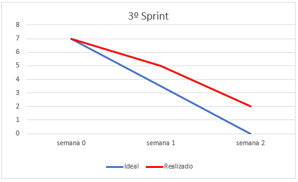
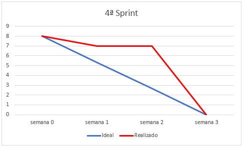

<h1 align="center"> Grupo Codados</h1>

 

## Sobre o Projeto PRO4Jobs :desktop_computer:

* PRO4Jobs é uma aplicação Desktop com o objetivo de gerenciar vagas de emprego, otimizar o trabalho das pessoas do setor de Recursos Humanos;
* O Candidato poderá vizualizar e se candidatar as vagas de emprego que o RH disponibilizará;
* Este Projeto tem como Cliente a empresa PRO4TECH;
* A aplicação tem como linguagem de programação o Java, pois foi a linguagem designada para o Segundo Semestre de Banco de Dados;
* Para registrar vagas, candidatos e o pessoal do RH, é necessário a criação de um Banco de Dados, o qual será conectado com a linguagem Java;
* Utilizando a Metodologia Scrum, a equipe pode desenvolver este Projeto com agilidade, qualidade e boa organização.
 

## Informações sobre o Cliente :technologist:

| Cliente | Contato |
| --- | --- |
| `Rafael Monteiro` | rafael.monteiro@pro4tech.com.br |

 

## Integrantes do grupo :woman_technologist: :man_technologist: :  
| Integrante | Função |
| --- | --- |
| `Cainan Thomas Branco Santos` | Desenvolvedor  
[
](https://www.linkedin.com/in/cainan-santos-70938094/ "link")|
| `Daniele de Jesus Souza` | Desenvolvedora  
[
](https://www.linkedin.com/in/daniele-de-jesus-souza-35859a209 "link")|
| `Felipe dos Santos Bispo` |  Desenvolvedor  
[
](https://www.linkedin.com/in/felipe-bispo-632104235/ "link") |
| `Guilherme Augusto Wunderlich Serapião` | Desenvolvedor  
[
](https://www.linkedin.com/in/guilherme-wunderlich-aa56a2228/ "link") |
| `Júlia Pereira Quitério` | Desenvolvedora  
[
](https://www.linkedin.com/in/j%C3%BAlia-quit%C3%A9rio-934894205/ "link") |
| `Lucas Emanoel Teixeira Engracio da Silva` |Product Owner  
[
](https://www.linkedin.com/in/lucas-emanoel-teixeira-engracio-da-silva-ab5611234/ "link")|
| `Marcella Yanes Borges do Amaral` | Scrum Master  
[
](https://www.linkedin.com/in/marcella-yanes-589371209/ "link")|
 

## :page_facing_up: Backlog do Produto:
 

 Prioridade | Requisito |
| --- | --- |
|1| Cadastrar RH |
|1| Autentificar RH |
|1| Cadastrar Candidato |
|1| Autentificar Candidato|
|1| Cadastrar Vaga de Emprego |
|2| Visualizar Vagas de Emprego |
|2| Anexar Currículo |
|2| Criar Relatório das Vagas|
|2| Cadastrar Candidato a Vaga de Emprego |
|2| Avaliar Candidato |
|2| Realizar Relatório dos Candidatos Aprovados|
|2| Emitir Relatório dos Candidatos |
|2| Excluir Vaga de Emprego |
|3| Alterar Vaga de Emprego |
|3| Implementar Progresso do Candidato |
|3| Filtrar Vagas por Área de Atuação |
|3| Gerar relatório para o RH |

### Legenda: 1- Imprescendível; 2- Importante; 3- Desejável
 

## Cronograma:

 

<h2>Tecnologias Utilizadas :electric_plug:</h2>

 

<h2>Users Storys :man_shrugging:</h2>

   ## Sprint 1:
   * Como __RH__ desejo __me cadastrar com os meus dados__ para __executar minhas funções na empresa__.
   * Como __RH__ desejo __autentificar na aplicação__ para __acessar o sistema__.
    

  ## Sprint 2:
  * Como __Candidato__ desejo __me cadastrar com meus dados pessoais__ para __me candidatar a vagas de emprego__.
  * Como __Candidato__ desejo __autentificar na aplicação__ para __conseguir acessar os serviços do sistema__.
  * Como __RH__ desejo __cadastrar vagas de emprego__ para __que os candidatos possam se candidatar__.
  

  ## Sprint 3:
  * Como __RH__ desejo __alterar as informações das vagas de emprego__ para __que as informações sejam coerentes ao status de uma vaga__.
  * Como __RH__ desejo __excluir as vagas de emprego__ para __quando o limite de vagas forem preenchidas__.
  * Como __Candidato__ desejo __me candidatar a uma vaga de emprego__ para __que eu possa participar do processo seletivo__.
  * Como __RH__ desejo __visualizar as vagas de emprego__ para __fazer o gerenciamento das vagas__.
  * Como __RH__ desejo __visualizar relatórios dos candidatos__ para __realizar o processo seletivo__. (Adiado para a Sprint 4)
  * Como __Candidato__ desejo __inserir meu currículo__ para __que poder ter mais chances de passar nos processos seletivos__. (Adiado para a Sprint 4)
  * Como __RH__ desejo __vizualizar os relatórios das vagas de emprego__ para __realizar o devido gerenciamento__. (Adiado para a Sprint 4)
  
 
 ## Sprint 4:
 * Como __Candidato__ desejo __vizualizar meu progresso no processo seletivo__ para __saber como estou indo na vaga__.
 * Como __RH__ desejo __avaliar os candidatos__ para __dar continuidade ao processo seletivo__.
 * Como __RH__ desejo __visualizar os relatórios dos candidatos aprovados em uma determinada vaga__ para __contatar eles__.
 * Como __Candidato__ desejo __ultilizar um filtro de pesquisa de vagas__ para __encontrar vagas que possuo mais afinidade__.
 * Como __RH__ desejo __visualizar relatórios para o setor de Recursos Humanos__ para __realizar o gerenciamento dos dados__.
 

## 🏁 Sprint Backlog da 1ª Sprint(29/08 - 18/09)

 - Cadastrar RH; 
 - Autentificar RH;
 - Gravar dados em arquivo CSV (Temporário).
 - Protótipo de Tela: Cadastro de Candidato. 
 

### Atividades Realizadas durante a 1ª Sprint(29/08 - 18/09)
 
 - Modelagem de Dados;
 - Gráfico BurnDown;
 - Levantamento de Requisitos Funcionais.
 

## :chart_with_downwards_trend: BurnDown da 1ª Sprint

 

## 🏁 Sprint Backlog da 2ª Sprint(19/09 - 09/10)

- Cadastrar Candidato;
- Autentificar Candidato;
- Cadastrar Vaga.

 

###  Atividades Realizadas durante a 2ª Sprint(19/09 - 09/10)
- Modelo de Entidade Relacional;
- Criar Script SQL;
- Criar design das Telas.
 

## :chart_with_downwards_trend: BurnDown da 2ª Sprint

 

## 🏁 Sprint Backlog da 3ª Sprint(13/10 - 06/11)

- Visualizar Vagas de Emprego;
- Anexar Currículo; (Adiado para Sprint 4)
- Criar relatório das Vagas; (Adiado para Sprint 4)
- Cadastrar Candidato a Vaga;
- Emitir relatórios dos Candidatos; (Adiado para Sprint 4)
- Excluir Vaga de Emprego;
- Alterar Vaga de Emprego.
 

## :chart_with_downwards_trend: BurnDown da 3ª Sprint

 

## 🏁 Sprint Backlog da 4ª Sprint(07/11 - 27/11)

- Criar relatório das Vagas;
- Anexar Currículo;
- Emitir relatórios dos Candidatos;
- Avaliar Candidato;
- Gerar relatório para o RH;
- Implementar progresso do Candidato;
- Filtrar Vagas por Área de Atuação;
- Emitir relatórios dos Candidatos Aprovados.
 

## :chart_with_downwards_trend: BurnDown da 4ª Sprint

 

<h2>Demonstração do Projeto</h2>

 

 

